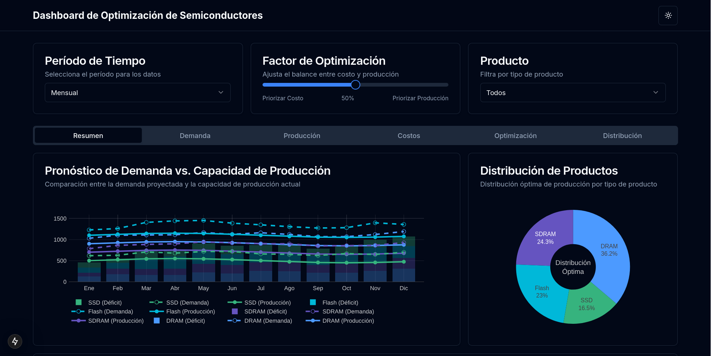
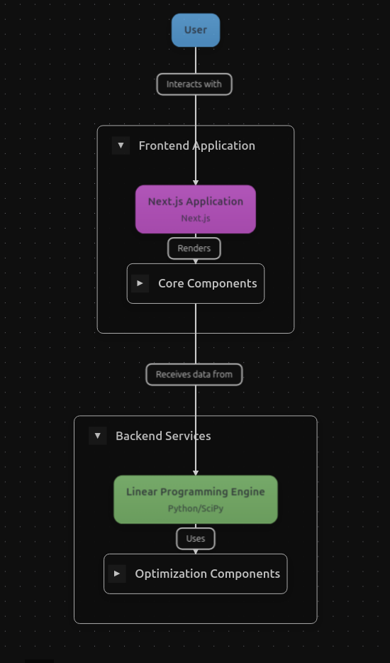
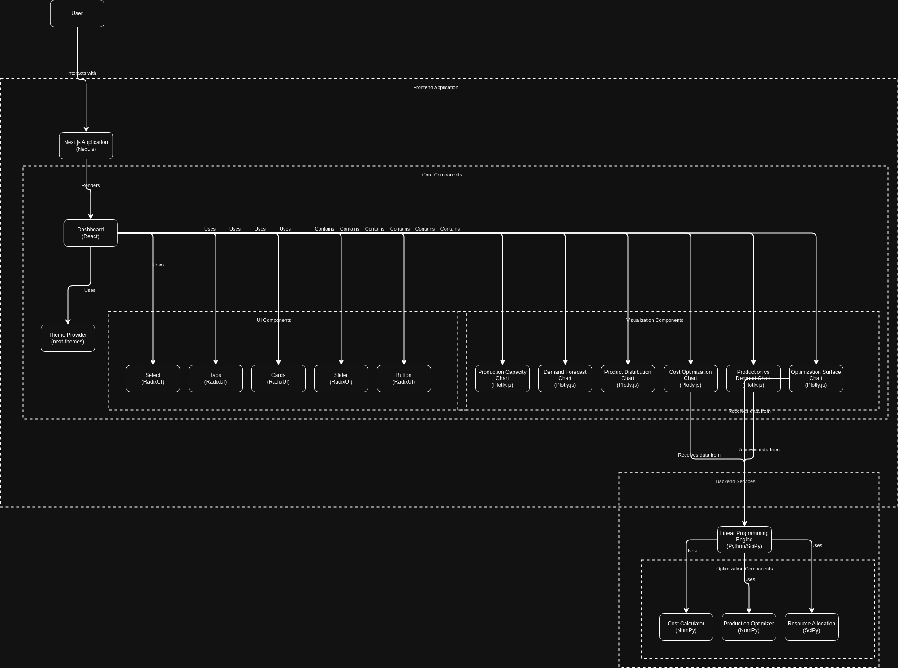
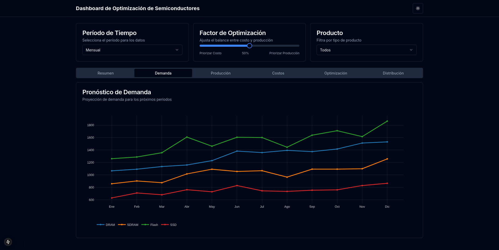
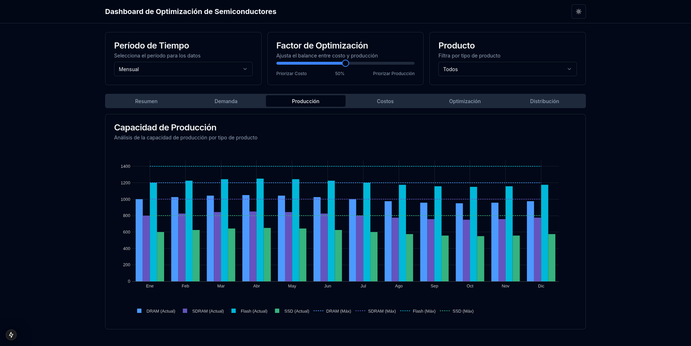
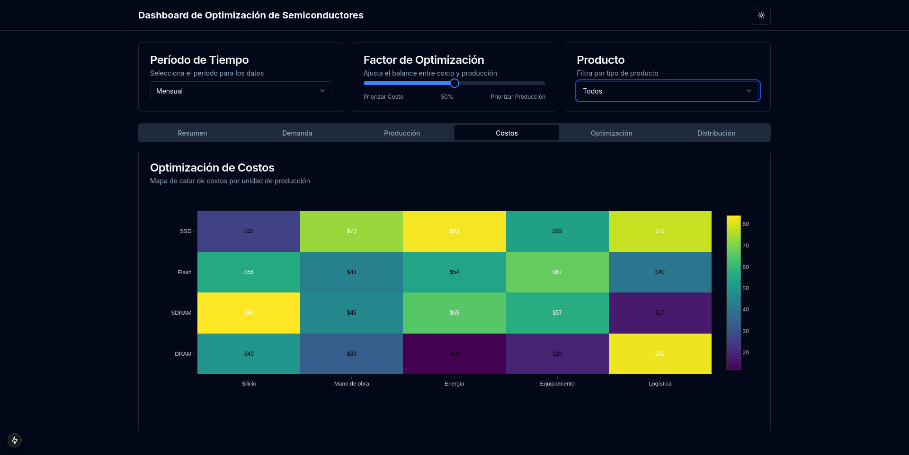
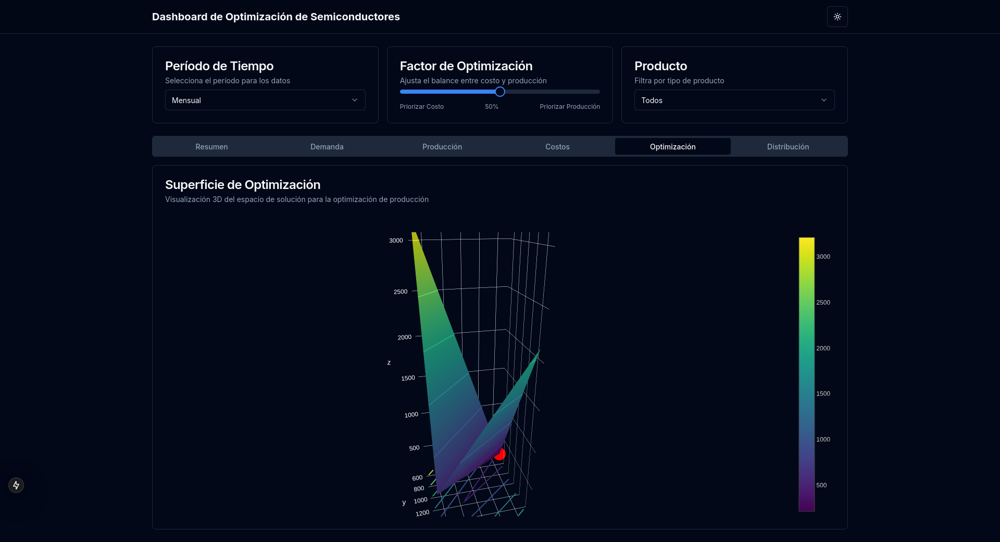
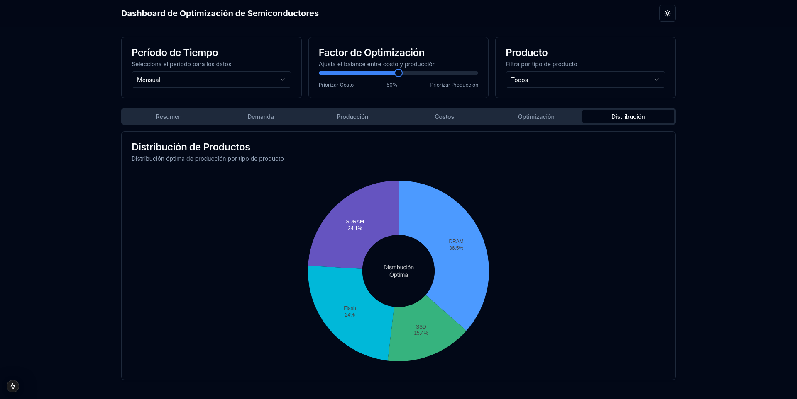

Este proyecto forma parte de la propuesta para el **Genius Arena Hackathon 2025** de **Talent Land**, en el track **"Production Planning: Linear Programming and automation through Python"**, presentado por **Micron**. La propuesta consiste en:

> **System in Python that automates the necessary calculations to balance production with demand, allowing more precise and efficient planning and reducing costs, using linear programming modeling.**
# Optimización de Producción con Programación Lineal

## 📌 Características Principales

Esta propuesta presenta una solución basada en programación lineal y machine learning, que permite automatizar la planificación de producción mediante un sistema desarrollado principalmente en Python. Se estructura en tres áreas clave: Data, BackEnd y FrontEnd. El área de **Data** consta de las fuentes de datos como bases de datos SQL, archivos CSV y/o JSON. El área de **BackEnd** consta de algoritmos en Python para análisis exploratorio, predicción de demanda y optimización de costos. Mientras que el área de **FrontEnd** consta de un Dashboard interactivo para visualizar y optimizar la producción de semiconductores interactuando con el BackEnd de Python. Su diseño posee un enfoque elegante y minimalista.

---

### 🗂️ Data

Como no se conocen las fuentes de datos, se prevé flexibilidad en su origen, tipo y formato:
- Bases de Datos SQL
- Archivos CSV
- Archivos JSON

---

### 🔙 BackEnd

Basado en Python, con un enfoque estructurado en análisis de datos y optimización:

1. **EDA (Análisis Exploratorio de Datos)**: Comprensión de la distribución de la demanda y patrones históricos antes de aplicar modelos de optimización.
2. **Regresión Lineal**: Predicción de la demanda futura y ajuste de parámetros.
3. **Random Forest**: Uso en caso de que la demanda no se ajuste bien a un modelo lineal. (Opcional)
4. **Programación Lineal**: Definición de la función objetivo (minimización de costos, maximización de producción, etc.) y establecimiento de restricciones.
5. **Spearman / Kendall**: Identificación de factores clave que afectan la producción. (Opcional)
6. **Bootstrapping**: Medición de la estabilidad del modelo. (Opcional)

---

## ⚙️ Arquitectura del Modelo de Programación Lineal

El modelo de programación lineal propuesto estaría desarrollado en **Python**, utilizando las librerías **SciPy**, **PuLP** y **Scikit-Learn**, entre otras, para optimizar la producción de semiconductores. Considerando:

- Data Sets provenientes de bases de datos SQL, archivos CSV o JSON.
- Restricciones de recursos (silicio, mano de obra, energía, equipamiento y logística).
- Demanda máxima por producto.
- Costos de producción asociados a cada tipo de semiconductor.
- Beneficios por unidad producida.

El modelo busca la combinación óptima que maximice el beneficio total, respetando todas las restricciones, necesidades y objetivos.

---

### 🎨 FrontEnd

Interfaz moderna e interactiva para la visualización de datos:
- **React y Next.js**: Estructura y funcionalidad del frontend.
- **Tailwind CSS**: Diseño y estilo visual.
- **Shadcn/ui**: Componentes de interfaz modernos.
- **Plotly.js**: Creación de visualizaciones interactivas.

---

## 📊 Esta Primera Propuesta de Dashboard posee

1. **Selector de Período de Tiempo**: Para ajustar la granularidad de los datos (semanal, mensual, trimestral o anual).
2. **Ajuste del Factor de Optimización**: Para evaluar cómo diferentes estrategias afectan la producción y los costos.
3. **Selector de Producto**: Para filtrar los datos por tipo de semiconductor (DRAM, SDRAM, memoria Flash o SSD).
4. **Navegación por Pestañas**:
   - **Resumen**: Vista general con gráficos clave.
   - **Demanda**: Análisis detallado de los pronósticos.
   - **Producción**: Visualización de la capacidad instalada.
   - **Costos**: Mapa de calor para la optimización de costos.
   - **Optimización**: Visualización en 3D del espacio de solución.
   - **Distribución**: Distribución óptima de la producción por producto.

---

## 📊 Se Plantea una Segunda Propuesta de Dashboard para poder visualizar los Modelos de Data Science y Machine Learning

1. **EDA (Análisis Exploratorio de Datos):**  
   Permite comprender la distribución de la demanda y detectar patrones históricos. Esta visualización interactiva sirve como base para el análisis posterior y está implementada con Plotly para gráficos dinámicos.

2. **Regresión Lineal:**  
   Se utiliza para predecir la demanda futura ajustando parámetros en función de datos históricos, permitiendo identificar tendencias y comportamientos lineales. La integración con React facilita la actualización en tiempo real de los resultados.

3. **Random Forest (Opcional):**  
   Ofrece una alternativa robusta para modelar comportamientos no lineales en la demanda, mejorando la precisión a través de la agregación de múltiples árboles de decisión. Su representación visual se optimiza en el dashboard con Next.js.

4. **Programación Lineal:**  
   Define la función objetivo (como la minimización de costos o la maximización de producción) y establece las restricciones necesarias para una optimización eficiente. La interacción del usuario con este modelo se mejora mediante gráficos interactivos creados con Plotly.

5. **Spearman / Kendall (Opcional):**  
   Identifica y cuantifica los factores clave que afectan la producción a través del análisis de correlaciones, proporcionando una visión clara sobre la fuerza y dirección de las relaciones entre variables. La visualización se actualiza dinámicamente para facilitar el análisis.

6. **Bootstrapping (Opcional):**  
   Evalúa la estabilidad y confiabilidad del modelo mediante técnicas de remuestreo, asegurando resultados consistentes y robustos. Este proceso es mostrado de manera interactiva para que el usuario pueda analizar la variabilidad de las predicciones en tiempo real.

---

## Beneficios del Dashboard

- **Visualización intuitiva**: Facilita la comprensión y análisis de datos complejos.
- **Decisiones informadas**: Muestra el impacto de diferentes estrategias de optimización de forma clara.
- **Optimización de recursos**: Identifica la mejor distribución de recursos en la producción.
- **Planificación estratégica**: Permite comparar la demanda con la capacidad productiva, mejorando la toma de decisiones a largo plazo.

---

## Diagrama de la aplicación

  

  

---

## Galería de Imágenes

  
  
  
  
  

